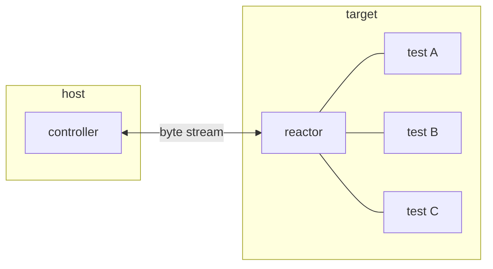

<div align="center">

# asrt — HIL Testing Framework

[**Documentation**](https://emsro.github.io/asrt/)

[](https://github.com/emsro/asrt/actions/workflows/cmake-single-platform.yml)

</div>

---

**asrt** is a hardware-in-the-loop (HIL) testing framework. Tests live on the device under test — the host discovers them, triggers execution, and collects results remotely. The target can push diagnostic records, parameters, and collected data to the host without being polled. Communication requires only a byte stream: serial, USB CDC, or TCP.

The target side needs no standard library, no heap, and no OS. Both sides are non-blocking and tick-driven, so they fit naturally into a bare-metal main loop or an event-driven host program.



The **reactor** runs on the target, holds a linked list of registered tests, and responds to requests from the host. The **controller** runs on the host, drives the session — negotiating the connection, enumerating tests, and triggering each one. Results and diagnostic records flow back asynchronously.

---

## Quick Start

Wire up a minimal reactor on your target. The host side of this example uses **`asrtio`** — a command-line runner bundled with the library as a convenience tool. You are not required to use it: the host API (`asrtc` / `asrtcpp`) is a plain C/C++ library you can drive from any host program.

`asrt_reac_assm` is the recommended entry point — it allocates and wires every channel module
(reactor, diagnostics, param, collect, stream) in one call.

### Target side — C

```c
#include "asrtr/reac_assm.h"
#include "asrtr/record.h"

static struct asrt_reac_assm assm;
static struct asrt_test      my_test;

static enum asrt_status run_my_test(struct asrt_record* rec)
{
    ASRT_RECORD_CHECK(rec, sensor_read() > 0);   /* non-fatal assertion */
    if (rec->state != ASRT_TEST_FAIL)
        rec->state = ASRT_TEST_PASS;
    return ASRT_SUCCESS;
}

int main(void)
{
    asrt_reac_assm_init(&assm, "my_device", 500);
    asrt_test_init(&my_test, "sensor_present", NULL, run_my_test);
    asrt_reactor_add_test(&assm.reactor, &my_test);

    for (;;) {
        asrt_reac_assm_tick(&assm, get_time_ms());

        /* drain the send queue into your byte-stream transport */
        struct asrt_send_req* req;
        while ((req = asrt_send_req_list_next(&assm.send_queue)) != NULL) {
            my_transport_write(req->chid, req->buff);
            asrt_send_req_list_done(&assm.send_queue, ASRT_SUCCESS);
        }
    }
}
```

### Target side — C++

```cpp
#include "asrtrpp/reac_assm.hpp"
#include "asrtrpp/task_unit.hpp"

struct sensor_present {
    static constexpr char const* name = "sensor_present";

    asrt::task<void> exec() {
        if (sensor_read() <= 0)
            co_await ecor::just_error(asrt::test_fail);
    }
};

int main()
{
    asrt_reac_assm                    assm;
    asrt::malloc_free_memory_resource mem;
    asrt::task_ctx                    task_ctx{mem};

    asrt::init(assm, "my_device", 500);

    asrt::task_unit<sensor_present> test;
    asrt::add_test(assm, test);

    for (;;) {
        task_ctx.tick();
        asrt::tick(assm, get_time_ms());

        // drain send queue into your byte-stream transport
        while (auto req = asrt::next(assm.send_queue)) {
            my_transport_write(req->chid, req->buff);
            req.finish(ASRT_SUCCESS);
        }
    }
}
```

### Host side

```sh
asrtio tcp --host 192.168.1.42 --port 8765
```

`asrtio` connects, enumerates all registered tests, runs them in sequence, and exits non-zero on any failure.

> **TODO:** Replace with UART example once the `uart` transport is implemented.
> **TODO:** Add example output here (will be generated from a README-driven test).

---

## Writing Tests

### C — synchronous callback

A test is a function that matches `asrt_test_callback`. The reactor calls it on every tick until it sets a terminal state (`ASRT_TEST_PASS`, `ASRT_TEST_FAIL`, or `ASRT_TEST_ERROR`) and returns.

```c
#include "asrtr/record.h"
#include "asrtr/diag.h"

/* With diagnostics: reports file/line when an assertion fails */
static enum asrt_status my_test(struct asrt_record* rec)
{
    struct my_ctx* ctx = (struct my_ctx*) rec->inpt->test_ptr;

    ASRT_CHECK(  &ctx->diag, rec, measure_voltage() > 2.5f ); /* non-fatal */
    ASRT_REQUIRE(&ctx->diag, rec, measure_voltage() < 5.0f ); /* fatal — returns if false */

    rec->state = ASRT_TEST_PASS;
    return ASRT_SUCCESS;
}

/* Multi-tick test: the callback is called on every tick until a terminal state is set.
   Tests can survive many ticks — useful when waiting for hardware to settle. */
struct settle_ctx {
    struct asrt_diag_client* diag;
    int                      ticks_remaining;
};

static enum asrt_status wait_for_settle(struct asrt_record* rec)
{
    struct settle_ctx* ctx = (struct settle_ctx*) rec->inpt->test_ptr;

    if (ctx->ticks_remaining > 0) {
        ctx->ticks_remaining--;
        return ASRT_SUCCESS;
    }

    /* Hardware has had time to settle — now check the result */
    ASRT_CHECK(&ctx->diag, rec, measure_voltage() > 2.5f);
    if (rec->state != ASRT_TEST_FAIL)
        rec->state = ASRT_TEST_PASS;
    return ASRT_SUCCESS;
}

/* Registration */
static struct settle_ctx ctx = { .diag = &assm.diag, .ticks_remaining = 10 };
asrt_test_init(&test, "voltage_settle", &ctx, wait_for_settle);
asrt_reactor_add_test(&assm.reactor, &test);
```
### C++ — coroutine style

```cpp
#include "asrtrpp/task_unit.hpp"
#include "asrtrpp/diag.hpp"

/* Single-step test: the whole body runs in one coroutine step */
struct check_voltage {
    static constexpr char const* name = "check_voltage";

    asrt_diag_client& diag;
    asrt_record*      rec;  /* populated by task_unit before exec() is called */

    asrt::task<void> exec() {
        float v = measure_voltage();
        ASRT_CO_CHECK(  diag, rec, v > 2.5f );  /* non-fatal: records failure, continues */
        ASRT_CO_REQUIRE(diag, rec, v < 5.0f );  /* fatal: records failure and aborts */
    }
};

/* Multi-tick test: suspends N times while hardware settles, then checks */
struct voltage_settle {
    static constexpr char const* name = "voltage_settle";

    asrt_diag_client& diag;
    asrt_record*      rec;

    asrt::task<void> exec() {
        for (int i = 0; i < 10; ++i)
            co_await asrt::suspend();           /* yield one tick per iteration */

        float v = measure_voltage();
        ASRT_CO_CHECK(diag, rec, v > 2.5f);
    }
};

// assm.diag is initialised by asrt::init(assm, ...)
asrt::task_unit<check_voltage>  test1{ check_voltage{  .diag = assm.diag } };
asrt::task_unit<voltage_settle> test2{ voltage_settle{ .diag = assm.diag } };
asrt::add_test(assm, test1);
asrt::add_test(assm, test2);
```

The `exec()` coroutine is advanced one step per tick. Every `co_await` is a suspension point — the reactor continues ticking other pending work between resumptions.

For tests that do not need coroutines, use `asrt::unit<T>` — it wraps the same C-style callback (`operator()` receives `rec` directly, same as the C API):

```cpp
struct pass_test {
    char const* name() const { return "pass_test"; }
    asrt_status operator()(asrt::record& rec) {
        rec.state = ASRT_TEST_PASS;
        return ASRT_SUCCESS;
    }
};
asrt::unit<pass_test> test;
asrt::add_test(assm, test);
```

---

## Common Patterns

### C — multi-step test with state

The C callback is invoked on every tick. Between ticks the reactor continues processing other work — including draining the send queue, receiving channel messages, and delivering param responses.

```c
struct adc_test_ctx {
    struct asrt_diag_client  diag;
    struct asrt_param_client param;
    struct asrt_param_query  query;
    uint32_t                 threshold;
    int                      step;
};

static void on_threshold(
    struct asrt_param_client*, struct asrt_param_query* q, uint32_t val)
{
    /* called from within the tick that delivers the PARAM RESPONSE */
    ((struct adc_test_ctx*) q->cb_ptr)->threshold = val;
}

static enum asrt_status adc_sweep(struct asrt_record* rec)
{
    struct adc_test_ctx* ctx = (struct adc_test_ctx*) rec->inpt->test_ptr;

    switch (ctx->step) {
    case 0:
        /* request threshold from the host; response arrives in a future tick */
        asrt_param_client_fetch_u32(
            &ctx->query, &ctx->param,
            asrt_param_client_root_id(&ctx->param),
            on_threshold, ctx);
        ctx->step = 1;
        break;
    case 1:
        /* wait until the callback has fired */
        if (asrt_param_query_pending(&ctx->param))
            break;

        adc_trigger();
        ctx->step = 2;
        break;
    case 2:
        if (!adc_ready())
            break;
        ASRT_CHECK(&ctx->diag, rec, adc_read() > ctx->threshold);
        if (rec->state != ASRT_TEST_FAIL)
            rec->state = ASRT_TEST_PASS;
        break;
    }
    return ASRT_SUCCESS;
}
```

The step/state machine pattern keeps control flow explicit and deterministic.

### C++ — coroutine sequence

The same test as a straight-line coroutine. `asrt::fetch` suspends until the PARAM RESPONSE arrives; `asrt::suspend` yields one tick.

```cpp
#include "asrtrpp/reac_assm.hpp"
#include "asrtrpp/task_unit.hpp"
#include "asrtrpp/diag.hpp"
#include "asrtrpp/param.hpp"

struct adc_sweep {
    static constexpr char const* name = "adc_sweep";

    asrt_diag_client&  diag;
    asrt_param_client& param;
    asrt_record*       rec;

    asrt::task<void> exec() {
        /* fetch threshold from host — suspends until PARAM RESPONSE arrives */
        uint32_t threshold = co_await asrt::fetch<uint32_t>(
            param, asrt::root_id(&param));

        adc_trigger();
        co_await asrt::suspend();   /* yield one tick while ADC converts */

        ASRT_CO_CHECK(diag, rec, adc_read() > threshold);
    }
};

asrt::task_unit<adc_sweep> test{ adc_sweep{ .diag = assm.diag, .param = assm.param } };
asrt::add_test(assm, test);
```

Each `co_await` is a suspension point — the reactor continues ticking other work (draining the send queue, receiving responses) between resumptions. The coroutine reads top-to-bottom even though it spans multiple event-loop iterations.

---

## Running Tests with `asrtio`

`asrtio` is a ready-made command-line runner bundled with the library. It handles connection, test enumeration, result reporting, and param loading out of the box. You can also write your own host program using the `asrtc` / `asrtcpp` libraries directly — `asrtio` is one implementation, not a required component.

```sh
asrtio [--verbose] [--timeout <ms>] [--params <json>] <subcommand>
```

| Subcommand | Description |
|------------|-------------|
| `tcp --host <addr> --port <port>` | Connect to a target over TCP |
| `rsim [--seed <n>]` | Run against the built-in reference simulator (no hardware needed) |

### Param config

The optional `--params` JSON file lets the host push structured configuration values to the target before each test run:

```json
{
    "*":              { "default": 1 },
    "adc_threshold":  [{ "val": 100 }, { "val": 200 }]
}
```

`"*"` applies to all tests. A named key applies only to the test whose name matches. An array entry causes the test to be executed once per element, with the corresponding tree loaded each time.

> **TODO:** Show example `asrtio` terminal output (will be generated from a README-driven test).

---

## Channels

The byte stream is multiplexed into independent **channels**, each identified by a 16-bit ID in the transported message. All multi-byte fields use big-endian encoding; messages are COBS-framed so the protocol works over any raw byte stream.

| ID | Name    | Direction         | Purpose                                   |
|----|---------|-------------------|-------------------------------------------|
|  2 | `CORE`  | bidirectional     | Test enumeration and execution            |
|  3 | `DIAG`  | target → host     | Assertion records (file, line, expression)|
|  4 | `PARAM` | host → target     | Structured parameter delivery             |
|  5 | `COLL`  | target → host     | Collected test output tree                |
|  6 | `STRM`  | target → host     | High-throughput typed record stream       |

Channels are opt-in. If a channel's module is not initialised it has zero runtime cost and the channel is silently ignored. `asrt_reac_assm` / `asrt::init` initialise all channels by default — you only need to wire them individually if you want to exclude some.

---

### Diagnostic channel (DIAG)

Records source-location diagnostics from the target. When an assertion fails, the target sends a RECORD message carrying the filename, line number, and expression to the controller. Records are fire-and-forget within the existing reliable stream.

**Target side (C)**
```c
/* assm.diag is initialised by asrt_reac_assm_init(&assm, ...) */

/* Inside a test callback: */
ASRT_CHECK( &assm.diag, rec, voltage > 2.5f );   /* non-fatal */
ASRT_REQUIRE(&assm.diag, rec, voltage < 5.0f );  /* fatal — returns on failure */
```

**Target side (C++)**
```cpp
/* assm.diag is initialised by asrt::init(assm, ...) */

/* Inside exec() — preferred: */
ASRT_CO_CHECK( diag, rec, voltage > 2.5f );   /* non-fatal: records failure, continues */
ASRT_CO_REQUIRE(diag, rec, voltage < 5.0f );  /* fatal: records failure and co_returns */

/* Low-level — emit a diagnostic record directly: */
co_await asrt::rec_diag(assm.diag, ASRT_FILENAME, __LINE__, "voltage low");
```

---

### Parameter channel (PARAM)

The host delivers a read-only tree of typed values — integers, floats, booleans, strings, objects, arrays — to the target before a test run. The target queries the tree by node ID or by key within a parent object. Responses are cached locally; repeated queries skip the round-trip.

**Target side (C)**
```c
/* assm.param is initialised by asrt_reac_assm_init(&assm, ...) */

static void on_value(
    struct asrt_param_client*, struct asrt_param_query* q, uint32_t val)
{
    ((struct my_ctx*) q->cb_ptr)->value = val;
}

/* Request a value — response arrives in a future tick via callback */
asrt_param_client_fetch_u32(
    &ctx->query, &ctx->param,
    asrt_param_client_root_id(&ctx->param),
    on_value, ctx);

/* Poll until delivered */
if (asrt_param_query_pending(&ctx->param))
    return ASRT_SUCCESS; /* try again next tick */
```

**Target side (C++)**
```cpp
/* assm.param is initialised by asrt::init(assm, ...) */

/* Fetch by node ID — suspends until response arrives */
uint32_t baud = co_await asrt::fetch<uint32_t>(assm.param, root_id);

/* Find a child by key */
float vref = co_await asrt::find<float>(assm.param, root_id, "vref");
```

---

### Collector channel (COLL)

The target pushes structured measurement results — samples, traces, derived values — to the host during a test run. The host assembles incoming nodes into a `flat_tree` that can be inspected or exported after the test ends.

**Target side (C)**
```c
/* assm.collect is initialised by asrt_reac_assm_init(&assm, ...) */

/* Each append is fire-and-forget but only one can be in-flight at a time.
   Poll client.state: ACTIVE means ready for the next append. */
struct coll_ctx {
    struct asrt_collect_client* collect;
    asrt_flat_id                result_id;
    int                         step;
};

static enum asrt_status push_results(struct asrt_record* rec)
{
    struct coll_ctx* ctx = (struct coll_ctx*) rec->inpt->test_ptr;

    /* busy — previous append still in flight */
    if (asrt_collect_client_is_busy(ctx->collect))
        return ASRT_SUCCESS;

    switch (ctx->step) {
    case 0:
        asrt_collect_client_append_object(
            ctx->collect, ctx->collect->root_id, "result",
            &ctx->result_id, NULL, NULL);
        ctx->step = 1; break;
    case 1:
        asrt_collect_client_append_u32(
            ctx->collect, ctx->result_id, "count", 42, NULL, NULL);
        ctx->step = 2; break;
    case 2:
        rec->state = ASRT_TEST_PASS; break;
    }
    return ASRT_SUCCESS;
}
```

**Target side (C++)**
```cpp
/* assm.collect is initialised by asrt::init(assm, ...) */

flat_id root   = asrt::root_id(assm.collect);
flat_id result = co_await asrt::append<asrt::obj>(assm.collect, root,   "result");
                 co_await asrt::append<uint32_t >(assm.collect, result, "count", 42u);
                 co_await asrt::append<float    >(assm.collect, result, "mean",  3.14f);
```

---

### Stream channel (STRM)

High-throughput transfer of typed, fixed-size records. The target defines a **schema** — a sequence of typed fields — once; subsequent DATA messages carry only the raw bytes. Schemas are cleared on test boundaries.

**Target side (C)**
```c
/* assm.stream is initialised by asrt_reac_assm_init(&assm, ...) */

static const enum asrt_strm_field_type_e schema_fields[] = {
    ASRT_STRM_FIELD_U32,    /* timestamp */
    ASRT_STRM_FIELD_FLOAT,  /* voltage   */
};
#define RECORD_SIZE (4 + 4)  /* sizeof(uint32_t) + sizeof(float) */

struct strm_ctx {
    struct asrt_stream_client* stream;
    int                        step;
    uint32_t                   sample;
};

static enum asrt_status emit_samples(struct asrt_record* rec)
{
    struct strm_ctx* ctx = (struct strm_ctx*) rec->inpt->test_ptr;

    /* busy — wait for previous send to complete */
    if (ctx->stream->state == ASRT_STRM_WAIT)
        return ASRT_SUCCESS;

    switch (ctx->step) {
    case 0:
        asrt_stream_client_define(
            ctx->stream, 0,
            schema_fields, 2,
            NULL, NULL);
        ctx->step = 1; break;
    default: {
        if (ctx->sample >= 100) {
            rec->state = ASRT_TEST_PASS;
            break;
        }
        uint8_t buf[RECORD_SIZE];
        memcpy(buf,     &ctx->sample, 4);             /* timestamp */
        float v = 20.0f + 0.1f * ctx->sample;
        memcpy(buf + 4, &v, 4);                       /* voltage   */
        asrt_stream_client_emit(ctx->stream, 0, buf, RECORD_SIZE, NULL, NULL);
        ctx->sample++;
        break;
    }
    }
    return ASRT_SUCCESS;
}
```

**Target side (C++)**
```cpp
/* assm.stream is initialised by asrt::init(assm, ...) */

auto schema = co_await asrt::define<uint32_t, float>(assm.stream, 0);
for (uint32_t i = 0; i < 100; ++i)
    co_await asrt::emit(schema, i * 10, 20.0f + 0.1f * i);
```

<details>
<summary>Field type tags</summary>

| Tag  | Name  | Wire size | C type     |
|------|-------|-----------|------------|
| 0x01 | u8    | 1         | `uint8_t`  |
| 0x02 | u16   | 2         | `uint16_t` |
| 0x03 | u32   | 4         | `uint32_t` |
| 0x04 | i8    | 1         | `int8_t`   |
| 0x05 | i16   | 2         | `int16_t`  |
| 0x06 | i32   | 4         | `int32_t`  |
| 0x07 | float | 4         | `float`    |
| 0x08 | bool  | 1         | `bool`     |

All multi-byte values use big-endian encoding.
</details>

---

## Architecture

```
┌─────────────────────────────────────────────┐
│                   asrtio                    │  host tool (C++, libuv)
├──────────────────────┬──────────────────────┤
│      asrtrpp         │       asrtcpp        │  C++ wrappers
│  (target / reactor)  │  (host / controller) │
├──────────────────────┼──────────────────────┤
│        asrtr         │        asrtc         │  C core
│  (target / reactor)  │  (host / controller) │
├──────────────────────┴──────────────────────┤
│                    asrtl                    │  shared protocol / framing
└─────────────────────────────────────────────┘
         target side          host side
         C / C++              C / C++ / any FFI
```

Two axes:

- **Target vs. host** — `asrtr*` runs on the device, `asrtc*` runs on the host. They are independent and can be compiled into different toolchains.
- **C vs. C++** — the `*l`, `*r`, `*c` sub-libraries are pure C. The `*lpp`, `*rpp`, `*cpp` wrappers add a C++ coroutine layer on top. `asrtio` is C++ only.

| Sub-library | Language | Side   | Role |
|-------------|----------|--------|------|
| `asrtl`     | C        | shared | Protocol definitions, COBS framing, channel dispatch, flat-tree, allocator |
| `asrtr`     | C        | target | Reactor: test registration, execution, CORE/DIAG/PARAM/COLL/STRM channel modules |
| `asrtc`     | C        | host   | Controller: connection setup, test enumeration, result collection |
| `asrtlpp`   | C++      | shared | Coroutine task type (`asrt::task<T>`), event-loop context (`task_ctx`), flat-type traits |
| `asrtrpp`   | C++      | target | Sender wrappers around `asrtr`: `co_await` assertions, param/collect/stream APIs |
| `asrtcpp`   | C++      | host   | Sender wrappers around `asrtc`: `co_await` param/collect/stream server operations |
| `asrtio`    | C++      | host   | Command-line test runner (TCP, rsim), progress bar, params JSON loading |

A **channel module** (e.g. the DIAG module inside `asrtr`) is a node in a linked list owned by the reactor or controller. It handles one channel ID and can be omitted entirely if the feature is not needed.

---

## Integrating the Library

```cmake
include(FetchContent)
FetchContent_Declare(
    asrt
    GIT_REPOSITORY https://github.com/emsro/asrt.git
    GIT_TAG        main
)
FetchContent_MakeAvailable(asrt)
```

Available targets:

| Target           | What it provides |
|------------------|-----------------|
| `asrt::asrtl`    | Protocol, framing, allocator — no external deps |
| `asrt::asrtr`    | Reactor (C) — depends on `asrtl` |
| `asrt::asrtc`    | Controller (C) — depends on `asrtl` |
| `asrt::asrtlpp`  | C++ task/coroutine base — depends on `asrtl`, ecor |
| `asrt::asrtrpp`  | C++ reactor wrappers — depends on `asrtr`, `asrtlpp` |
| `asrt::asrtcpp`  | C++ controller wrappers — depends on `asrtc`, `asrtlpp` |

`asrt::asrtl` + `asrt::asrtr` is sufficient for a bare-metal target with no host-side dependency.

---

## Pure C Core

The core libraries — `asrtl`, `asrtr`, and `asrtc` — are pure C99 with no external dependencies.

- The **reactor** compiles into C, C++, or Rust firmware without glue code.
- The **controller** C API is wrappable by any language with a C FFI — Python, Go, Rust, etc.
- The C++ wrappers (`asrtrpp`, `asrtcpp`) and the host tool (`asrtio`) are optional layers. They are not required for integration.
