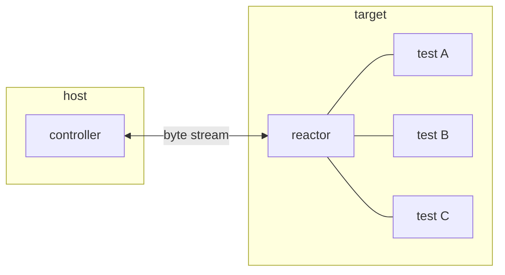
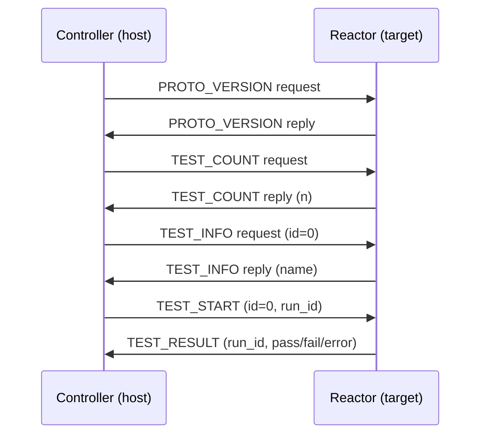

# Automated System for Software & Embedded Regression Testing

Host-driven testing framework for software and embedded targets.

Tests live on the target (Device Under Test). The host discovers and runs them remotely, collects results, and reports them. The target does not need a display, filesystem, or OS — only the ability to send and receive bytes.

## How it works

The **reactor** runs on the target. Tests are registered into it at startup. It sits idle until the host connects, then responds to requests: it can report a description, enumerate registered tests by name, and execute any of them on demand. When a test finishes the reactor sends the result back.

The **controller** runs on the host. It drives the session: it negotiates a connection, queries the test list, selects which tests to run, and triggers execution one at a time. Results arrive asynchronously via callbacks.

Both sides are non-blocking and tick-driven — the caller advances them by calling a tick function periodically, which fits naturally into an event loop or a bare-metal main loop.

## Transport

The link is a raw byte stream (serial, USB CDC, TCP socket, or any similar channel). Messages are framed with COBS encoding so the protocol works over any byte-stream transport.

