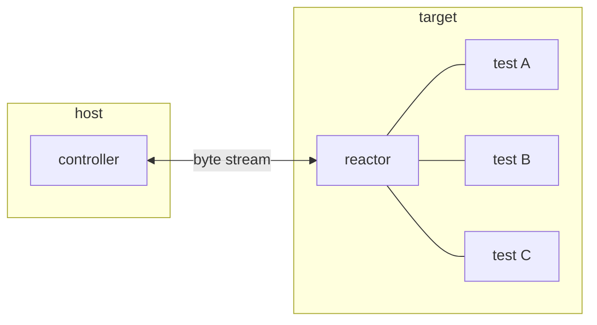
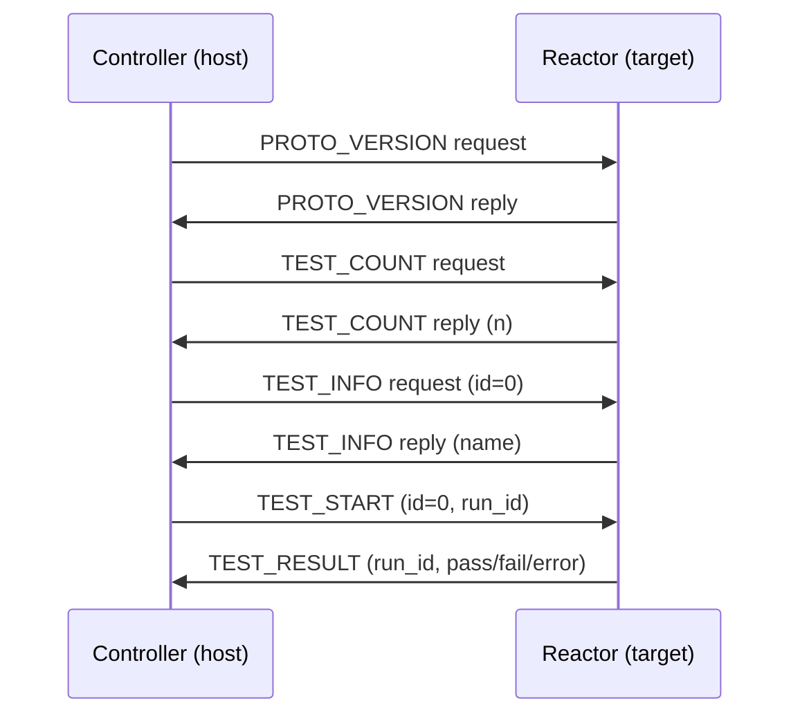
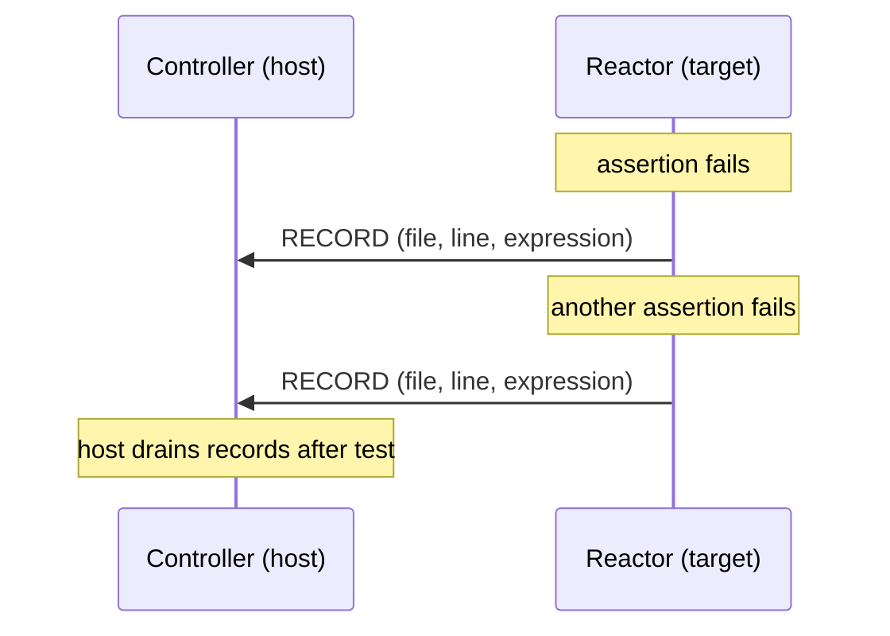
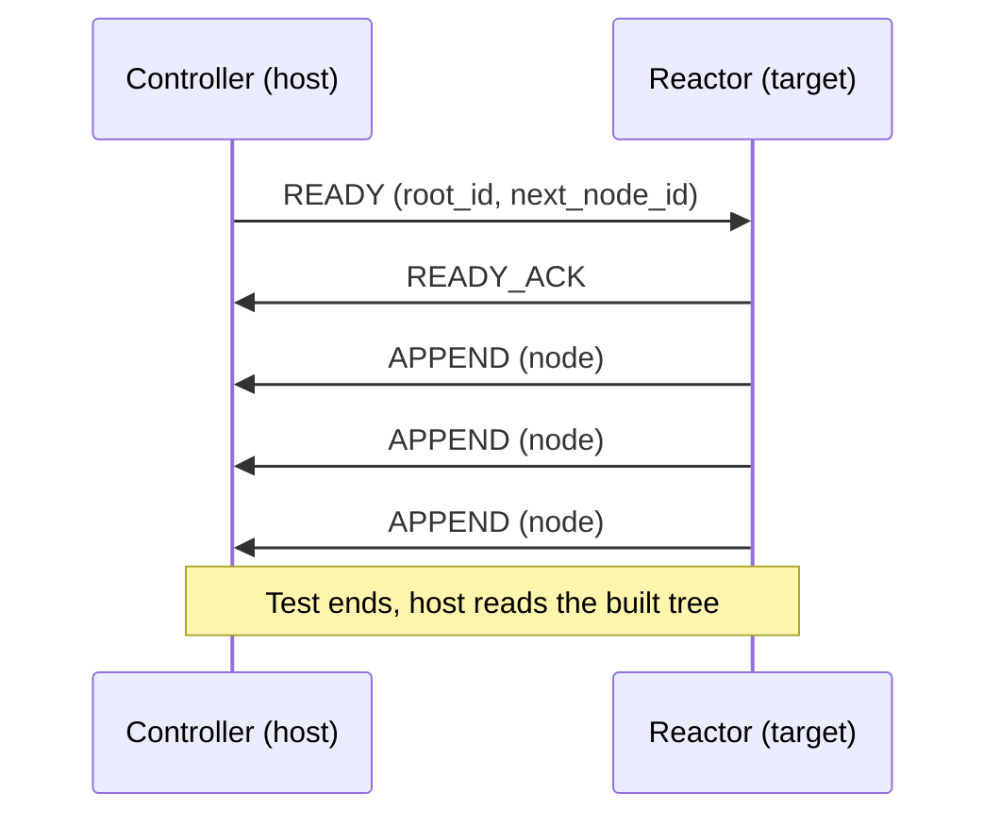

# Automated System for Software & Embedded Regression Testing

Host-driven testing framework for software and embedded targets.


Tests live on the target (Device Under Test). The host discovers and runs them remotely, collects results, and reports them. The target does not need a display, filesystem, or OS — only the ability to send and receive bytes.



## How it works

The **reactor** runs on the target. Tests are registered into it at startup. It sits idle until the host connects, then responds to requests: it can report a description, enumerate registered tests by name, and execute any of them on demand. When a test finishes the reactor sends the result back.

The **controller** runs on the host. It drives the session: it negotiates a connection, queries the test list, selects which tests to run, and triggers execution one at a time. Results arrive asynchronously via callbacks.

Both sides are non-blocking and tick-driven — the caller advances them by calling a tick function periodically, which fits naturally into an event loop or a bare-metal main loop.

## Transport

The link is a raw byte stream (serial, USB CDC, TCP socket, or any similar channel). Messages are framed with COBS encoding so the protocol works over any byte-stream transport.



## Channel abstraction

The byte stream is multiplexed into independent **channels**, each identified by a 16-bit ID in the transported message. Two channels are defined by the library:

| ID | Name    | Purpose                            |
|----|---------|------------------------------------|
|  2 | `CORE`  | test enumeration and execution     |
|  3 | `DIAG`  | diagnostic records from the target |
|  4 | `PARAM` | structured parameter queries       |
|  5 | `COLL`  | structured data collection         |

On each side — reactor (target) and controller (host) — functionality is composed from **modules**, one per channel. A module is a node in a linked list: it owns a channel ID and a receive callback, and can send messages back through a shared sender handle.

```
reactor side                     controller side
────────────────────────────     ────────────────────────────
asrtr_reactor  (CORE channel)    asrtc_controller  (CORE channel)
asrtr_diag     (DIAG channel)    asrtc_diag        (DIAG channel)
   …                                …
```

Modules are opt-in: if a feature is not needed, its module is simply not initialised and has zero runtime cost. The same mechanism allows adding custom modules for application-specific channels without modifying the library.

## Diagnostic channel

The **diagnostic channel** (channel ID 3) carries source-location records from the target to the host. When a test assertion fails (via `ASRTR_CHECK` or `ASRTR_REQUIRE`), the reactor sends a RECORD message containing the filename, line number, and the failed expression. The controller collects these so that can be drained after each test.



The flow is unidirectional — the target fires records and the host accumulates them. There is no acknowledgement or handshake; records are best-effort within the existing reliable byte stream.

## Parameter channel

In addition to test control and diagnostics, the framework provides a **parameter channel** (channel ID 4) for querying structured configuration data from the target at runtime.

The target exposes a read-only tree of typed values — integers, floats, booleans, strings, objects, and arrays — through a flat-tree data structure. The host can:

- **Query by node ID** — fetch a known node directly.
- **Find by key** — look up a child node by name within a parent object.

Responses are cached on the host side; repeated queries for nodes already in the cache are served locally without a round-trip. The client API supports both C and C++ with typed callback helpers (`query_u32`, `find_str`, …) and C++ template wrappers (`client.query<uint32_t>(…)`, `client.find<uint32_t>(…)`).

```mermaid
sequenceDiagram
    participant Host as Controller (host)
    participant Target as Reactor (target)

    Host->>Target: READY (root_id)
    Target->>Host: READY_ACK (max_msg_size)
    Target->>Host: QUERY (node_id)
    Host->>Target: RESPONSE (node_id, key, type, value, …)
    Target->>Host: FIND_BY_KEY (parent_id, key)
    Host->>Target: RESPONSE (node_id, key, type, value, …)
    Note over Host,Target: Responses are cached; repeated queries are served locally
```

## Collector channel

The **collector channel** (channel ID 5) lets test code on the target push structured results — measurements, traces, collected samples — up to the host during a test run. The host assembles the incoming data into a `flat_tree` that can be inspected or exported after the test ends.



The controller signals readiness with a READY message, the reactor acknowledges, then pushes APPEND messages — one per tree node, fire-and-forget (no per-append ACK). The controller assembles incoming nodes into a `flat_tree`. If an append fails (duplicate node, invalid parent, tree full), the controller sends an ERROR and the session is aborted.

Node IDs are auto-assigned: the READY message carries a `next_node_id` counter that both sides use to stay in sync without per-node negotiation.

## Pure C core

The core libraries — `asrtl`, `asrtr`, and `asrtc` — are intentionally written in pure C. This maximises integration flexibility:

- The **reactor** can be compiled into C, C++, or Rust firmware with no additional glue.
- The **controller** can be wrapped by any language that supports a C FFI — Python, Go, Rust, etc.

The C++ wrappers (`asrtrpp`, `asrtcpp`) and the host tool (`asrtio`) are optional layers built on top. They are not required for integration.

## asrtio — host tool

`asrtio` is a ready-made command-line test runner built on the C++ wrappers and libuv. It connects to a target, discovers and executes all registered tests, and reports results with a progress bar.

```
asrtio [--verbose] [--timeout <ms>] [--params <json>] <subcommand>
```

| Subcommand | Description |
|------------|-------------|
| `tcp --host <addr> --port <port>` | Connect to a target over TCP |
| `rsim [--seed <n>]` | Run against a built-in reference simulator |
